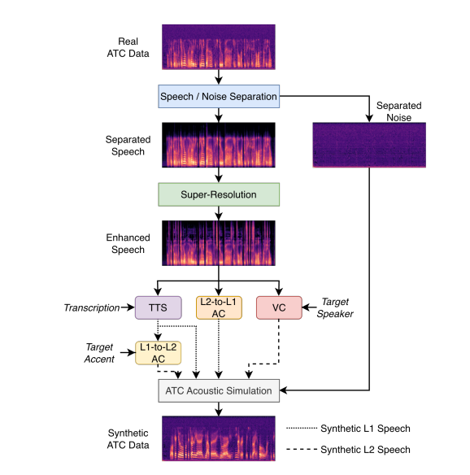

# ATC Synthetic Data Generation

<a href="https://arxiv.org/abs/2606.21340"></a>
<a href="https://gitlab.inria.fr/rbagat/atc_generation"></a>
<a href="#"></a>
<br>

This is an **unofficial, runnable re-implementation** of the paper

"Synthetic Audio Generation Framework for Air Traffic Control Speech Recognition"

by Raphaël Bagat<sup>1</sup>, Zhe Zhang<sup>2</sup>, Junichi Yamagishi<sup>2</sup>, Irina Illina<sup>1</sup>, Emmanuel Vincent<sup>1</sup>

<sup>1</sup> Université de Lorraine, CNRS, Inria, LORIA, F-54000 Nancy, France
<sup>2</sup> National Institute of Informatics, Tokyo, Japan

<!-- > **Note:** This repository is maintained independently ([@morris88826](https://github.com/morris88826)) and is not affiliated with or endorsed by the original authors. The [official repository](https://gitlab.inria.fr/rbagat/atc_generation) is not fully executable as published (missing glue code, undocumented checkpoints); this repo wires the same underlying open-source components into a pipeline that runs end-to-end. -->

## Introduction



Air Traffic Control (ATC) speech recognition datasets are scarce, noisy, and dominated by a handful of speaker accents. The framework augments existing ATC recordings into new synthetic training data by (1) separating speech from background radio/channel noise, (2) restoring the separated speech's bandwidth, and then (3) re-synthesizing its *content* through independent voice- and accent-transformation branches — before re-mixing every result with the original noise stem so the output still sounds like real ATC audio.

This repo implements the **Speech/Noise Separation → Super-Resolution → {Voice Conversion, L2-to-L1 Accent Conversion, TTS} → ATC Acoustic Simulation** path shown above, using [AudioSep](https://github.com/Audio-AGI/AudioSep), [AudioSR](https://github.com/haoheliu/versatile_audio_super_resolution), [SALT](https://github.com/BakerBunker/SALT), [TokAN](https://github.com/p1ping/TokAN), and [F5-TTS](https://github.com/SWivid/F5-TTS) respectively. The L1-to-L2 accent conversion branch shown in the diagram is part of the original paper's full framework and is not implemented here.


## Code

### Setup
```bash
conda create -n atc_generation python=3.10 -y
conda activate atc_generation
pip install -r requirements.txt
```

Model checkpoints can be downloaded from [here](https://drive.google.com/drive/folders/1tPQHK3J05nJlKPkeUxcb-ztwhhq6Y_gv?usp=sharing) and put them under the checkpoints directory.

### Data layout

Datasets can be downloaded from [here](https://drive.google.com/drive/folders/1tPQHK3J05nJlKPkeUxcb-ztwhhq6Y_gv?usp=sharing) and put them under the data directory.

Each supported dataset (`atc-dataset`, `atco2-asr`, `atcosim`) is expected under `data/<dataset>/data/` as:


### Usage
**Single file:**

```bash
python inference.py --audio_path path/to/utterance.wav [--transcript "..."] --out_dir ./output
```

**Full dataset (batch):**

```bash
python main.py --dataset atco2-asr --out_dir ./data
```

Outputs for each utterance land under `<out_dir>/<dataset>/aug/`, split into `01_separated_*`, `02_superresolved_speech`, `03_clean_speech_{vc,l2_to_l1,tts}`, and `04_atc_simulated_speech_{vc,l2_to_l1,tts}`.

### Repository layout

```
├── main.py                  # Batch entry point: runs the full pipeline over a dataset
├── inference.py             # Single-file entry point + the pipeline stage implementations
├── demo.ipynb                # Step-by-step notebook with intermediate audio players, for exploring the pipeline
├── libs/
│   ├── prepare_models.py    # Loads/builds all 5 third-party models
│   ├── apply_aas.py         # Speech + noise re-mixing (ATC channel re-simulation)
│   └── helper.py            # Notebook audio-grid display helper
├── third_party/              # Vendored copies of AudioSep, AudioSR, SALT, TokAN, F5-TTS
├── checkpoints/               # Downloaded model weights (gitignored)
├── data/<dataset>/data/       # Input wav/ + transcript/ pairs (gitignored)
├── data/<dataset>/aug/        # Pipeline outputs, mirroring the steps above (gitignored)
└── figures/                  # README assets
```

### Acknowledgments

This pipeline is built entirely on top of the following open-source projects (see `third_party/` for vendored copies and their original licenses):

- [AudioSep](https://github.com/Audio-AGI/AudioSep) — Liu et al., *Separate Anything You Describe*
- [AudioSR](https://github.com/haoheliu/versatile_audio_super_resolution) — Liu et al., *Versatile Audio Super-resolution at Scale*
- [SALT](https://github.com/BakerBunker/SALT) — voice conversion / speaker anonymization
- [TokAN](https://github.com/p1ping/TokAN) — accent normalization via self-supervised tokens
- [F5-TTS](https://github.com/SWivid/F5-TTS) — flow-matching TTS

## Citation

If you use this pipeline, please cite the original paper this work re-implements:

```bibtex
@article{bagat2026synthetic,
  title     = {Synthetic Audio Generation Framework for Air Traffic Control Speech Recognition},
  author    = {Bagat, Rapha{\"e}l and Zhang, Zhe and Yamagishi, Junichi and Illina, Irina and Vincent, Emmanuel},
  booktitle = {Interspeech},
  year      = {2026}
}
```
